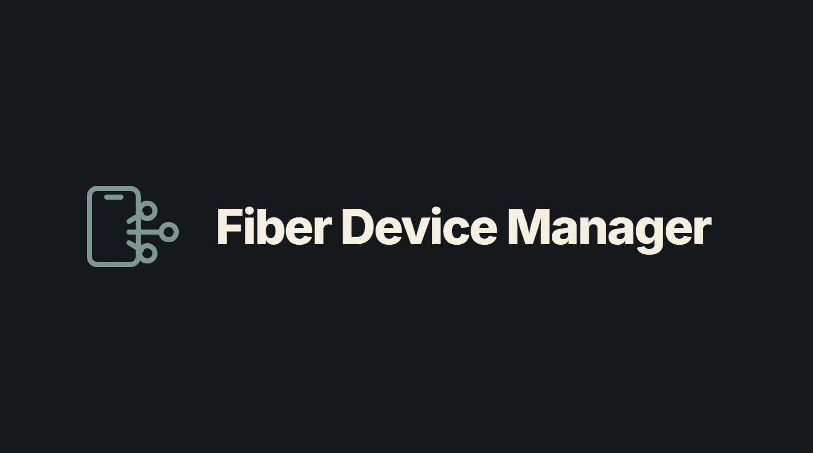
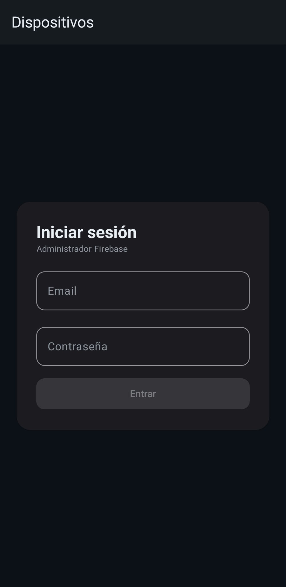
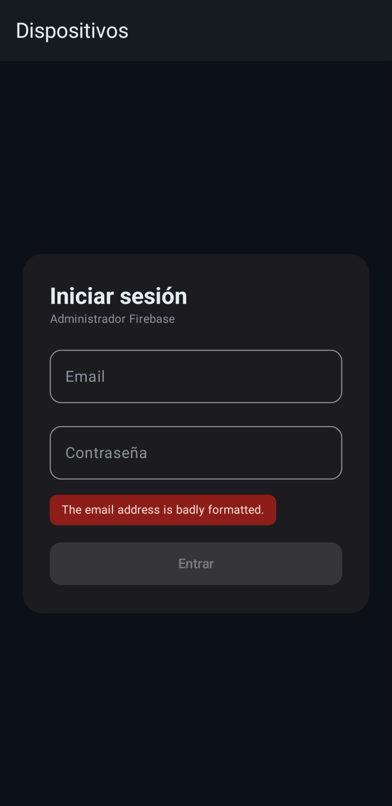
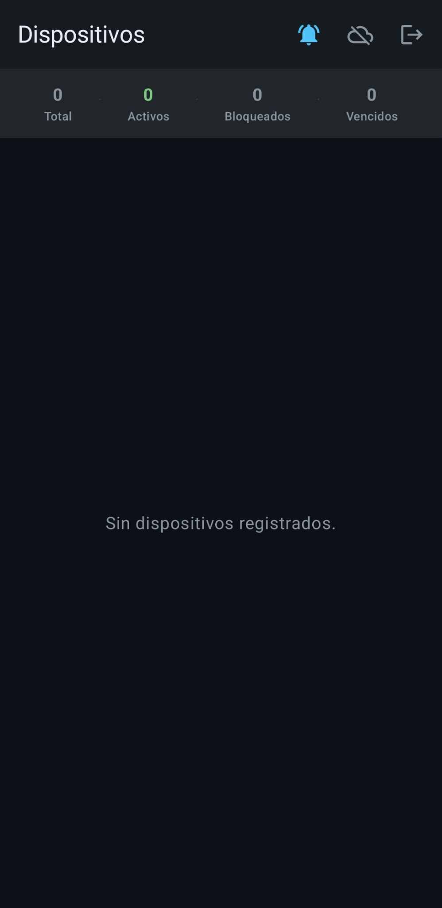
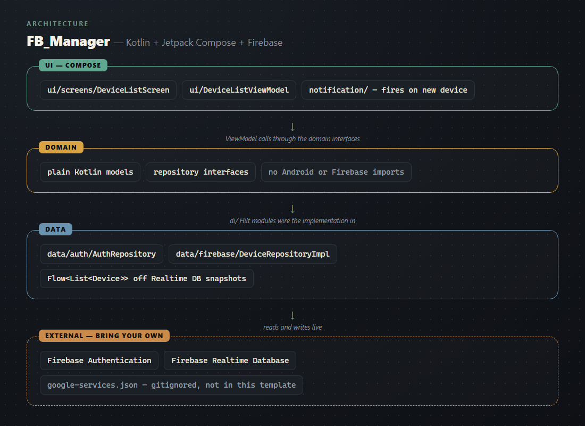

# FB_Manager [TEMPLATE]

An Android console for a Firebase-backed device fleet: sign in, see connected devices update in
real time, get notified when a new one appears.

## Showcase

Real screenshots from the app running on a physical device, not the Firebase console.

 |  | 
:---:|:---:|:---:
Sign-in screen | Real-time field validation | Empty device list

These three screens run without a live backend behind them, which is why they're the ones shown:
sign-in, its own input validation, and the list's empty state. The populated device list only
renders once real devices are talking to a real Firebase project — that's the one screen this
template can't show without also showing someone's live production data, so it's left out on
purpose rather than faked or blurred.

## Setup

See [SETUP.md](./SETUP.md) — you'll need your own free Firebase project.

## Architecture

See [ARCHITECTURE.md](./ARCHITECTURE.md) for the full breakdown.

## License

MIT — see [LICENSE](./LICENSE).
