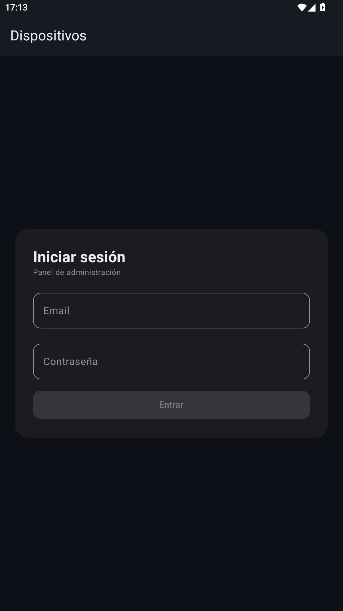
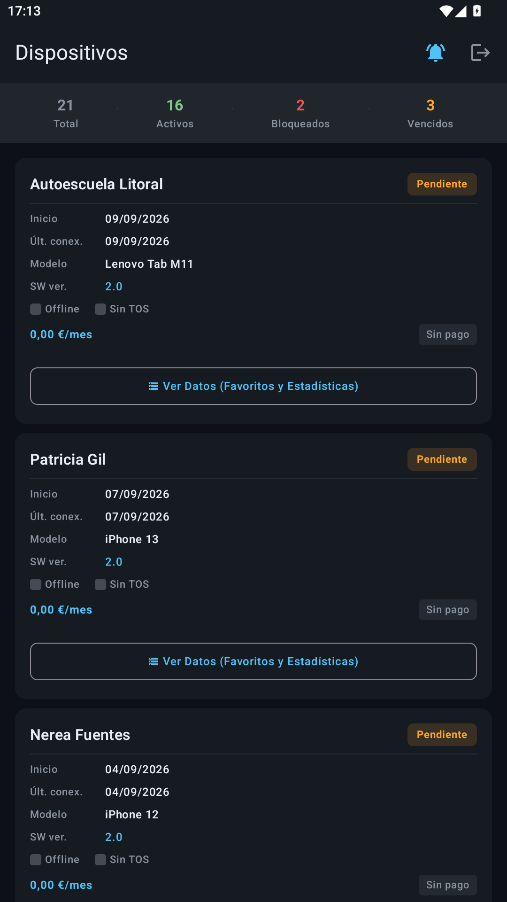
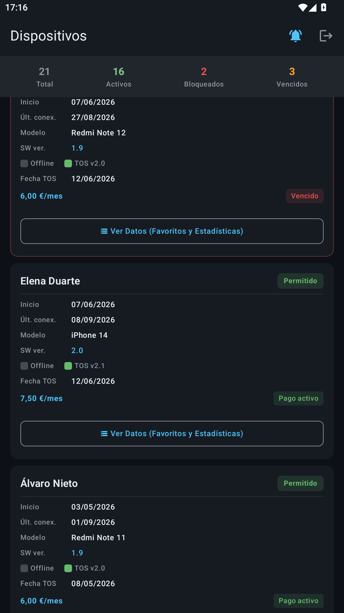
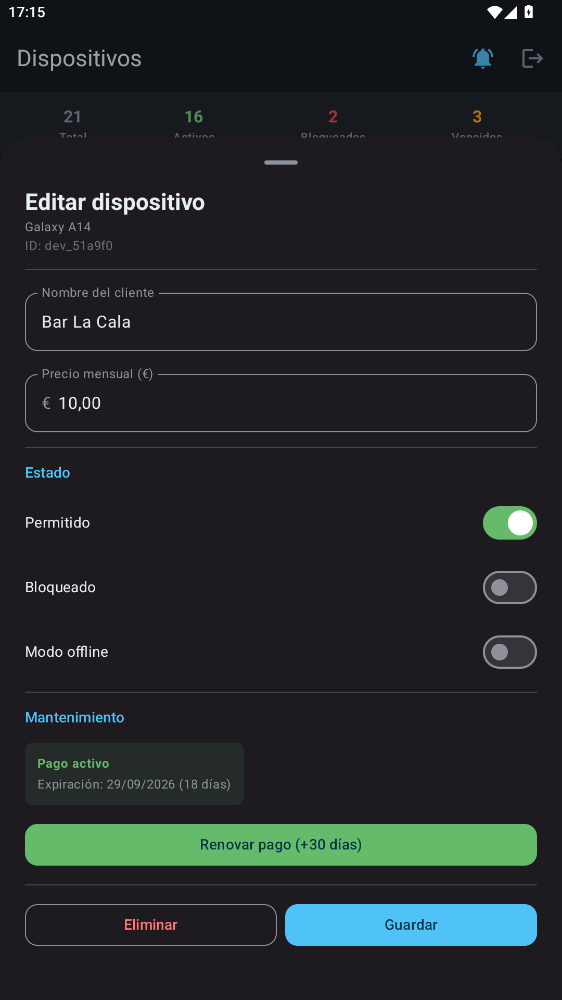
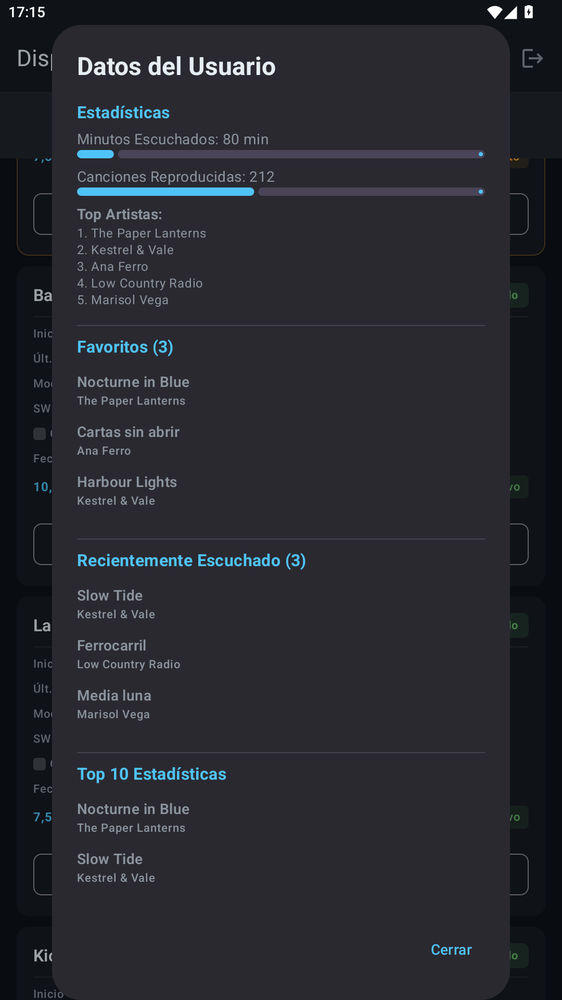

# Fiber Device Manager


Android admin console for a managed device fleet. Sign in, browse every registered device
with its state and payment status, open one to rename it, block it or renew its
subscription, and check the per-device listening data. It was the operator side of a
music-player product called SoundWave.

The whole thing runs on-device. There is no backend and no `INTERNET` permission in the
manifest — the fleet sits in a local Room database that gets seeded with demo data the
first time the app opens.

## Run it

```
git clone https://github.com/PresidenteOG/fiber-device-manager.git
cd fiber-device-manager
./gradlew assembleDebug        # or open in Android Studio and hit Run
```

Sign in with the demo admin account:

| Email | Password |
|---|---|
| `1234@test.com` | `1234` |

The first launch writes 21 invented devices into the database, spread across every state the
UI can show — allowed, blocked and pending; payment active, expiring, overdue and unset — so
the list, the summary counters and the detail screens all have something in them. None of it
is real customer data.

## Screenshots

Captured from the debug build running on the demo account. Every screen is on the seed data.

| | |
|---|---|
|  |  |
| The admin sign-in. | The fleet list — total, active, blocked and overdue counts across the top. |
|  |  |
| Cards colour-code the state: an overdue device is flagged red, paid ones green. | Open a device to rename it, flip allowed / blocked / offline, renew the subscription, or delete it. |
|  | |
| The listening data for that device — minutes, play count, top artists, favourites and recent tracks. | |

## Architecture

Compose UI over a ViewModel, talking to a repository interface in `domain/` that is
implemented on top of Room in `data/local/`. Hilt wires it together.
[ARCHITECTURE.md](./ARCHITECTURE.md) has the diagram and the rest of the detail;
[SETUP.md](./SETUP.md) covers the build prerequisites.

## License

PolyForm Noncommercial 1.0.0 — see [LICENSE](./LICENSE). Free to read, run and fork for
personal and non-commercial use.
